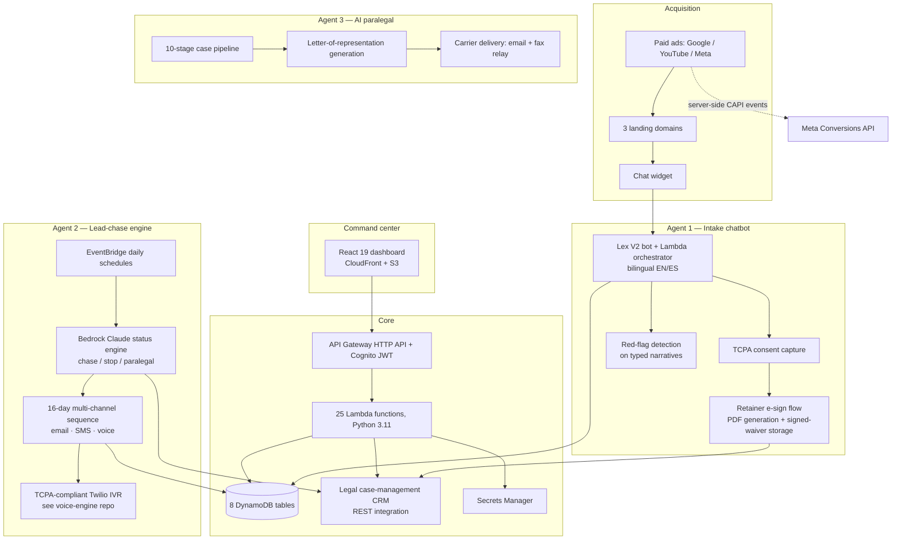

# Legal Intake AI Platform — Case Study

A production, multi-agent AI system that runs the **entire lead-intake operation of a U.S. personal-injury law firm**: website chat → qualification → e-signed retainer → CRM case → automated chase of unresponsive leads → AI-assisted case work. Designed, built, deployed, and operated end-to-end by one engineer (me), live in production since 2025.

> **About this repo.** This is a case study of a live client system. The client and all identifying details are anonymized; code in [`excerpts/`](excerpts/) is sanitized and representative, not the production source. The real system is private client property — I walk through it in interviews.

---

## The problem

Personal-injury firms live and die by lead response. The firm's reality before this system:

- Website visitors abandoned intake forms with no follow-up.
- The intake team **gave up on leads they couldn't reach** — cases were closed "no contact" even when the underlying claim was still viable and inside the statute of limitations.
- Paid ad spend (Google, YouTube, Meta) couldn't be attributed to signed cases.
- Every follow-up call and letter was manual.

## The system

Three cooperating AI workers, one command-center dashboard, one serverless AWS backbone.

### Agent 1 — Intake chatbot

A Lex V2-fronted conversational intake on the firm's landing pages (three domains, each mapped to a different ad channel).

- **Bilingual EN/ES** intake flow with contact/location "super widgets" for structured capture.
- **TCPA consent** captured verbatim with timestamp and channel, stored on the lead record and posted to the CRM — because downstream, the chase engine is only allowed to call leads that consented.
- **Tiered red-flag detection**: fast tier-1 heuristics at button-click time, and a tier-2 pass over the *typed narrative* at fulfillment time (where the real signal is), which also drives an intake-team alert email showing every captured field.
- **Retainer e-signature**: generates the agreement PDF, collects the signature, stores signed/unsigned waivers in separate S3 buckets, and creates the CRM case.
- **Returning-lead dedup**: a returning lead's fresh consent and narrative are posted to their *existing* CRM case instead of creating a duplicate.

### Agent 2 — Lead-chase engine

The firm's directive: **chase the leads intake gave up on.** The interesting part is deciding *who* to chase — a "closed" case in the CRM often just means "we couldn't reach them," which is precisely the lead worth chasing.

- An **Amazon Bedrock (Claude) status engine** reads each lead's CRM status *and* recent free-text case notes, reconciles them with the firm's own intake database (chat completed? retainer signed? incident type?), and returns a structured disposition: `chase`, `stop`, or `paralegal` (human review), each with a one-line plain-English reason.
- **Fail-safe by design**: on any AI failure — throttling, malformed JSON, model unavailable — the lead is routed to `paralegal`. An AI error can pause automation; it can never silently stop a lead's chase.
- **Statute-of-limitations awareness**: incident state and date-of-loss are enriched from the CRM when the intake record is blank, and SOL policy questions (per-state tables) were escalated to the firm's counsel rather than guessed in code.
- A **16-day multi-channel sequence** (email via SES, SMS, voice) with a human preview/approval gate in the dashboard before calls fire.
- Everything is **feature-flagged** (`VOICE_ENABLED`-style kill switches, schedules deployable-but-disabled) so infrastructure can ship to production safely ahead of legal sign-off.

### Agent 3 — AI paralegal

A 10-stage case pipeline that takes signed cases through first-notice-of-loss:

- Generates **letters of representation** from case data with firm-approved templates, hard forbidden-phrase rules (compliance constraints encoded in the generator, e.g. never include injury detail or SSNs), and per-carrier delivery rules — some insurance carriers only accept fax, so the system includes an email→fax relay path.
- Auto-routing rules for claim types, attorney-assignment defaults, and stage auto-advance gated behind a default-off flag until the CRM write-path was verified.

### Command-center dashboard

React 19 + TypeScript + Vite 7 + Tailwind 4 + TanStack Query, served from CloudFront/S3, authenticated by Cognito (JWT + MFA).

- Live pipeline stats, lead conversion rate, "cold list" alerts for leads pending too long.
- A microscope view per lead: full chat transcript, timeline, email history, CRM case link, call recordings/transcripts/PDF summaries.
- Admin actions: force-sign, resend retainer, bot pause/takeover, targeted chaser sends.
- Per-lead **source attribution pill** (Google / YouTube / Meta / TikTok / vendor / CRM-import / direct) with the ad name that produced the lead.

## Engineering decisions worth discussing

**One artifact, many functions.** 19 of the 25 Lambdas deploy from a single SAM artifact differing only by handler — one build, one dependency set, atomic deploys. The remaining functions (the chatbot orchestrator family) deploy standalone because their release cadence is coupled to marketing sites, not to the backend.

**AI with a hard quota.** The Bedrock status engine fires dozens of Claude calls per scheduled run against a ~10 requests/minute account quota. The fix was layered: client-side pacing under the quota, full-jitter exponential backoff on residual throttles, `ReservedConcurrentExecutions: 1` so overlapping invocations can't multiply the rate, and a wall-clock budget so a run degrades gracefully instead of timing out mid-list. Post-fix: zero throttles. See [`excerpts/bedrock_paced_client.py`](excerpts/bedrock_paced_client.py).

**The CRM is a second source of truth.** Legal CRMs are messy — statuses lag, notes are free-text HTML. The system treats the CRM and its own DynamoDB state as *two* sources to reconcile (in the AI prompt itself), rather than trusting either alone.

**Compliance encoded, not documented.** TCPA consent gates calling. Forbidden phrases are enforced in the letter generator. Recording-consent disclosure is part of the call flow. The rule of thumb: if a lawyer would ask "can you prove it?", the system writes an artifact.

**Operate like a team, alone.** Versioned S3 backup regime for every Lambda before any edit; a full-account baseline snapshot; an error-scanner Lambda that sweeps CloudWatch logs with a benign-pattern suppression list so real errors aren't buried; audit logging to a dedicated table; forensic post-mortems with evidence (a July lead-drop investigation cleared the code and pinned the cause on an ad-campaign misconfiguration — with the receipts).

## Results

- The firm's intake now runs 24/7 in two languages with zero-touch retainer signing.
- Previously-abandoned leads are systematically re-engaged under consent and SOL constraints.
- Marketing spend is attributable end-to-end: ad → landing domain → chat → signed case → CRM, with server-side CAPI events verified delivering at 100% in the most recent audit.
- Operated in production by a single engineer with a clean incident record and evidence-backed post-mortems.

## Sanitized excerpts

| File | Pattern it demonstrates |
|---|---|
| [`excerpts/bedrock_paced_client.py`](excerpts/bedrock_paced_client.py) | Surviving a hard RPM quota: pacing + full-jitter backoff + fail-safe dispositions |
| [`excerpts/sam_shared_artifact.yaml`](excerpts/sam_shared_artifact.yaml) | One SAM artifact fanned out to many Lambda handlers |
| [`excerpts/ai_disposition_contract.md`](excerpts/ai_disposition_contract.md) | Constraining an LLM to a strict, auditable JSON decision contract |
